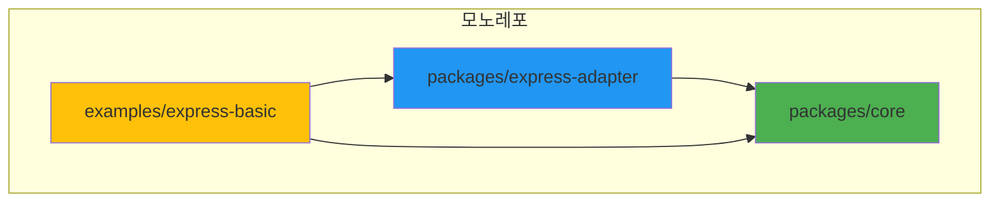
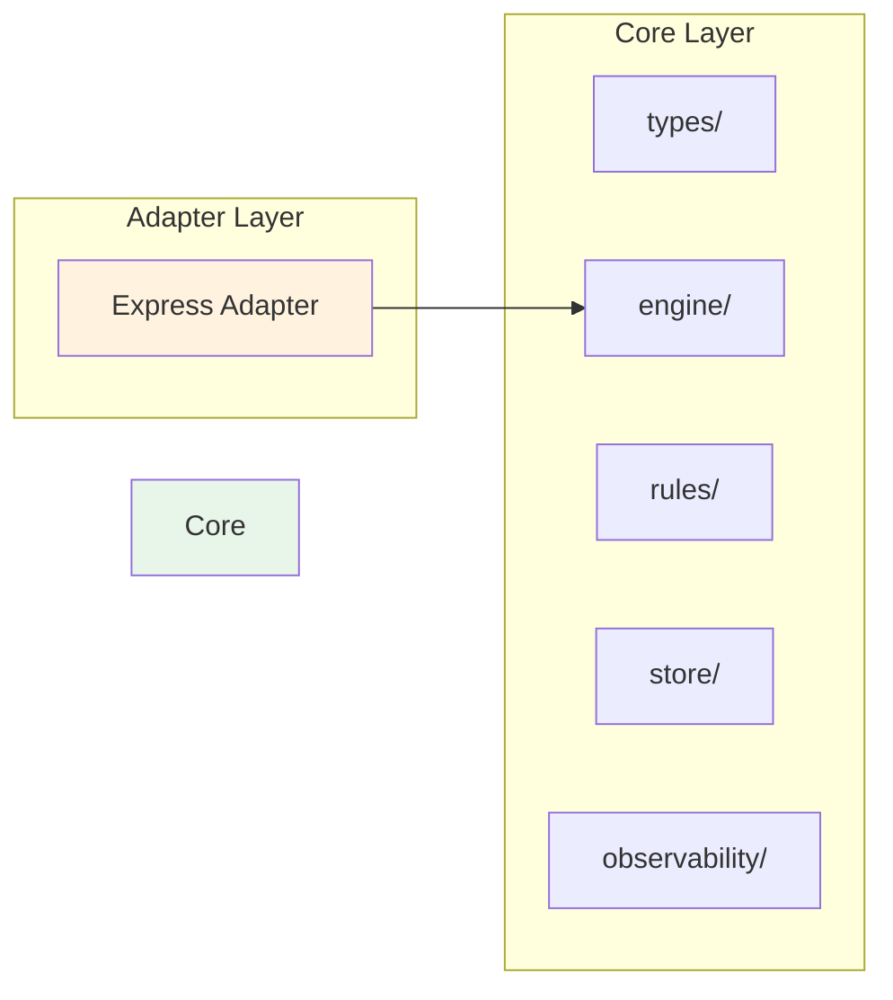

# 기여 가이드 🤝

JWT WAF 프로젝트에 기여해 주셔서 감사합니다!

## 시작하기

### 개발 환경 설정

```bash
# 저장소 클론
git clone https://github.com/your-org/jwt-waf.git
cd jwt-waf

# 의존성 설치
npm install

# 빌드
npm run build

# 테스트 (선택)
npm test
```

## 프로젝트 구조



## 계층 구조



## 기여 방법

### 1. 이슈 보고

버그나 기능 요청은 [GitHub Issues](https://github.com/your-org/jwt-waf/issues)에 등록해 주세요.

**버그 리포트 템플릿**:
```markdown
## 버그 설명
명확하고 간결한 버그 설명

## 재현 방법
1. ...
2. ...

## 예상 동작
어떻게 동작해야 하는지 설명

## 실제 동작
실제로 어떻게 동작하는지 설명

## 환경
- OS: [e.g. macOS 13]
- Node.js: [e.g. 18.0.0]
- @jwt-waf/core: [e.g. 0.1.0]
```

### 2. Pull Request 프로세스

1. **Fork & Clone**
   ```bash
   git clone https://github.com/YOUR_USERNAME/jwt-waf.git
   ```

2. **브랜치 생성**
   ```bash
   git checkout -b feature/my-new-feature
   # 또는
   git checkout -b fix/my-bug-fix
   ```

3. **코드 작성**
   - 코드 스타일 준수
   - 테스트 추가
   - 문서 업데이트

4. **커밋**
   ```bash
   git commit -m "feat: Add new security rule"
   # 또는
   git commit -m "fix: Fix token validation bug"
   ```

   **커밋 메시지 규칙**:
   - `feat:` 새로운 기능
   - `fix:` 버그 수정
   - `docs:` 문서 변경
   - `test:` 테스트 추가/수정
   - `refactor:` 리팩토링
   - `chore:` 빌드/설정 변경

5. **Push & PR**
   ```bash
   git push origin feature/my-new-feature
   ```
   GitHub에서 Pull Request 생성

### 3. 코드 스타일

- TypeScript 사용
- ESLint 규칙 준수
- 들여쓰기: 2칸
- 세미콜론 사용
- 단일 따옴표 사용

**예시**:
```typescript
export class MyRule implements Rule {
  readonly name = 'MyRule';
  
  async analyze(event: RiskEvent, store: Store): Promise<RuleResult> {
    // 구현
    return {
      ruleName: this.name,
      score: 0,
      reason: '정상'
    };
  }
}
```

## 새로운 규칙 추가

### 1. Rule 인터페이스 구현

```typescript
import { BaseRule, RiskEvent, Store, RuleResult } from '@jwt-waf/core';

export class MyCustomRule extends BaseRule {
  constructor() {
    super(
      'MyCustomRule',              // 규칙 이름
      '커스텀 규칙 설명',          // 설명
      5,                           // 가중치 (1-10)
      true                         // 활성화 여부
    );
  }

  async analyze(event: RiskEvent, store: Store): Promise<RuleResult> {
    // 1. 조건 체크
    const condition = this.checkCondition(event);
    
    if (!condition) {
      return this.passResult();
    }
    
    // 2. Store에서 상태 조회
    const key = `rule:my-custom:${event.ip}`;
    const count = await this.getCounterValue(store, key);
    
    // 3. 임계값 체크
    if (count >= 10) {
      return {
        ruleName: this.name,
        score: this.weight * 10,  // 최대 점수
        reason: '임계값 초과',
        details: { count, threshold: 10 }
      };
    }
    
    // 4. 카운터 증가 및 TTL 설정
    await this.incrementCounter(store, key, 1, 300);  // 5분 TTL
    
    return this.passResult();
  }
  
  private checkCondition(event: RiskEvent): boolean {
    // 커스텀 조건 로직
    return true;
  }
}
```

### 2. 테스트 작성

```typescript
import { MyCustomRule } from './my-custom-rule';
import { InMemoryStore } from '@jwt-waf/core';

describe('MyCustomRule', () => {
  let rule: MyCustomRule;
  let store: InMemoryStore;

 beforeEach(() => {
    rule = new MyCustomRule();
    store = new InMemoryStore();
  });

  it('정상 요청은 통과해야 함', async () => {
    const event = {
      /* RiskEvent 데이터 */
    };
    
    const result = await rule.analyze(event, store);
    expect(result.score).toBe(0);
  });

  it('임계값 초과 시 점수 부여', async () => {
    // 테스트 로직
  });
});
```

### 3. 문서화

`docs/RULES.md`에 규칙 설명 추가:

```markdown
### MyCustomRule (50점)

**목적**: 커스텀 공격 패턴 탐지

**트리거 조건**:
- 조건 1
- 조건 2

**오탐 방지**:
- 정상 패턴 설명

**설정 예시**:
```typescript
new MyCustomRule()
```
```

## 새로운 알림 채널 추가

### 1. Notifier 인터페이스 구현

```typescript
import { Notifier, NotificationEvent } from '@jwt-waf/core';
import axios from 'axios';

export class DiscordNotifier implements Notifier {
  constructor(private readonly webhookUrl: string) {}

  async notify(event: NotificationEvent): Promise<void> {
    const payload = {
      content: `🚨 ${event.message}`,
      embeds: [{
        title: event.type,
        color: this.getColor(event.severity),
        fields: [
          { name: 'IP', value: event.details.ip, inline: true },
          { name: 'Score', value: String(event.details.totalScore), inline: true }
        ]
      }]
    };

    await axios.post(this.webhookUrl, payload);
  }

  private getColor(severity: string): number {
    // 색상 코드 반환
    return 0xFF0000;
  }
}
```

### 2. Export 추가

`packages/core/src/index.ts`:

```typescript
export { DiscordNotifier } from './observability/notifiers/discord';
```

### 3. 예제 작성

```typescript
import { DiscordNotifier } from '@jwt-waf/core';

const discordNotifier = new DiscordNotifier('WEBHOOK_URL');
```

### 4. 문서화

`docs/NOTIFICATIONS.md`에 추가

## 질문이 있으신가요?

- GitHub Issues에 질문 등록
- 토론은 GitHub Discussions 사용

## 행동 강령

- 존중과 배려
- 건설적인 피드백
- 포용적인 언어 사용

## 라이센스

기여하신 코드는 [MIT License](./LICENSE)로 배포됩니다.

---

다시 한 번 기여해 주셔서 감사합니다! 🎉
