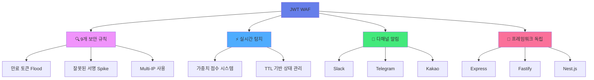
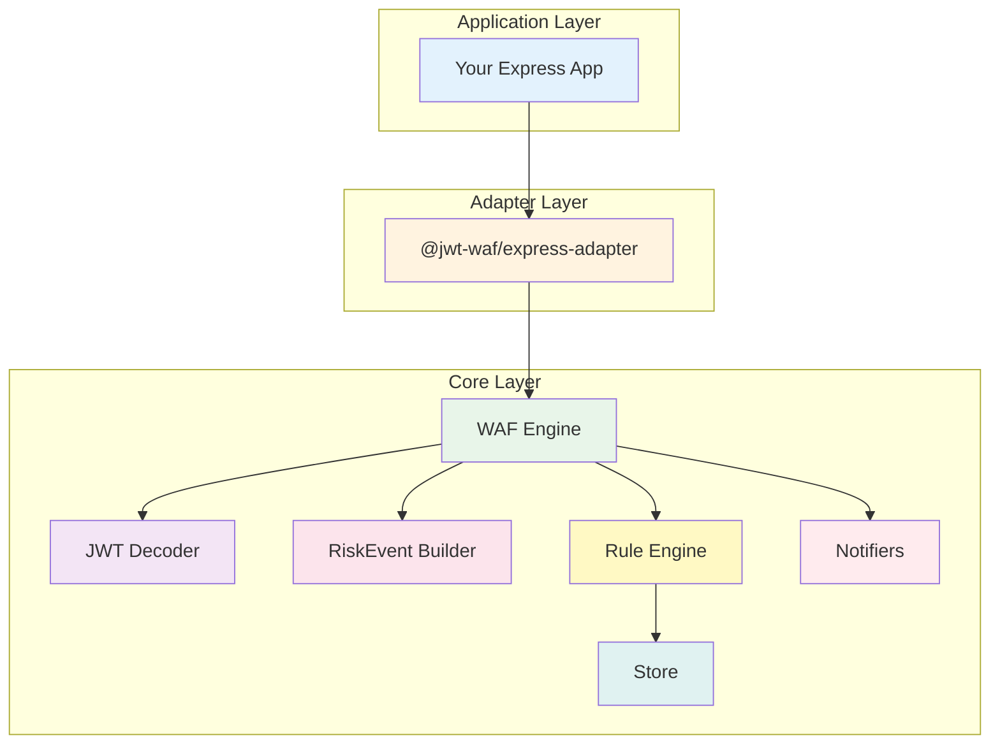
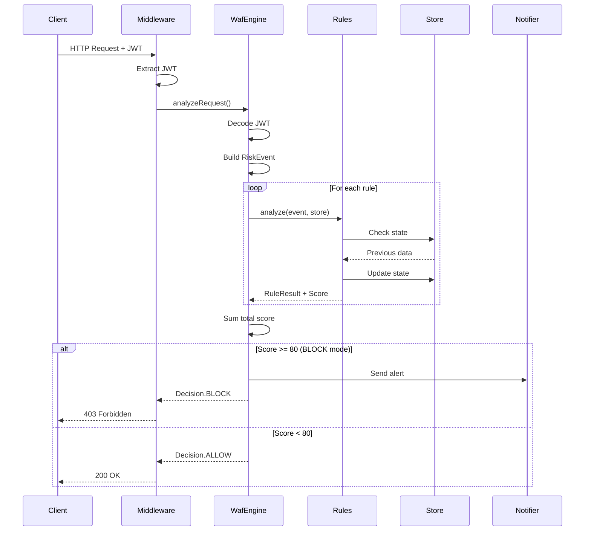
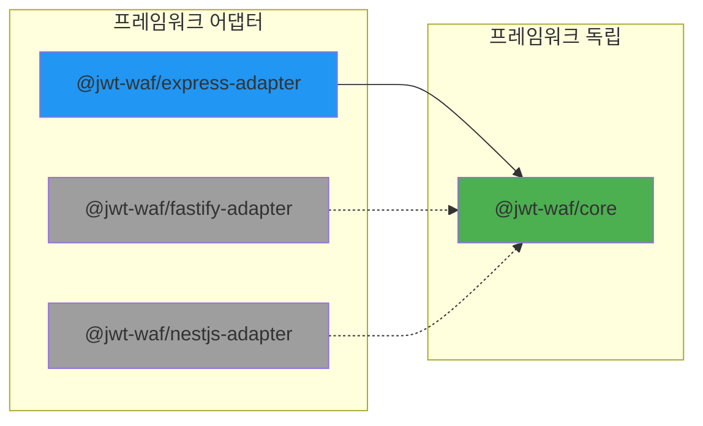
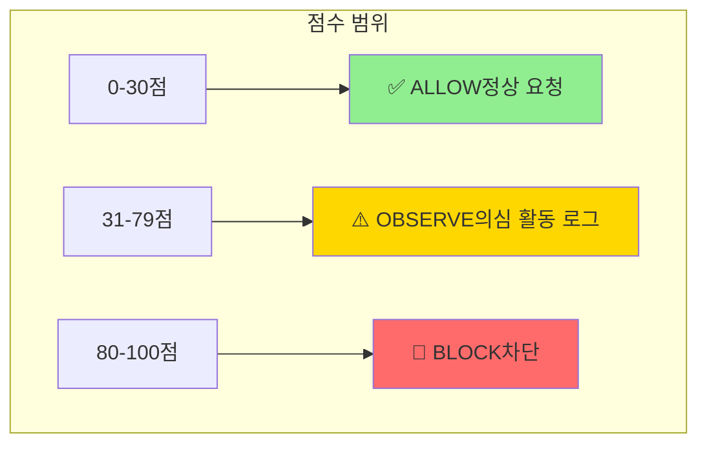
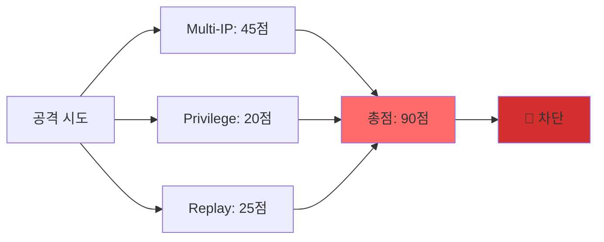

# JWT WAF 🛡️

**JWT 공격 탐지 특화 Web Application Firewall for Node.js**

[](https://www.npmjs.com/package/@jwt-waf/core)
[](https://opensource.org/licenses/MIT)
[](https://www.typescriptlang.org/)

JWT 토큰 기반 공격 패턴을 실시간으로 탐지하고 차단하는 경량 WAF 엔진입니다.

## ✨ 주요 특징



### 🎯 핵심 가치

- **JWT 특화**: JWT 공격 패턴에 최적화된 규칙 엔진
- **오탐 최소화**: 정상 트래픽 차단율 0%
- **확장 가능**: 커스텀 규칙 및 알림 채널 추가 가능
- **프레임워크 독립**: Express, Fastify, Nest.js 등 모든 Node.js 프레임워크 지원

## ⚡ 5분 빠른 시작

### 1️⃣ 설치

```bash
npm install @jwt-waf/core @jwt-waf/express-adapter
```

### 2️⃣ 기본 설정

```typescript
import express from 'express';
import { createWafMiddleware } from '@jwt-waf/express-adapter';
import {
  WafMode,
  InMemoryStore,
  ExpiredTokenFloodRule,
  InvalidSignatureSpikeRule,
  MultiIpTokenUseRule
} from '@jwt-waf/core';

const app = express();

// WAF 미들웨어 적용
app.use('/api', createWafMiddleware({
  wafConfig: {
    mode: WafMode.OBSERVE,  // 또는 WafMode.BLOCK
    blockThreshold: 80,
    rules: [
      new ExpiredTokenFloodRule(),
      new InvalidSignatureSpikeRule(),
      new MultiIpTokenUseRule()
    ],
    store: new InMemoryStore(),
    verifySignature: false
  }
}));

app.listen(3000);
```

### 3️⃣ 실행

```bash
npm start
```

**축하합니다! 🎉** 이제 JWT 기반 공격을 실시간으로 탐지할 수 있습니다.

자세한 가이드는 [5분 빠른 시작 문서](./docs/QUICK_START.md)를 참고하세요.

## 🏗️ 아키텍처

### 시스템 구조



### 요청 처리 흐름



### 계층 분리 원칙



## 🛡️ 보안 규칙

### 규칙 점수 시스템



### 9개 규칙 상세

| 규칙 | 점수 | 트리거 조건 | 목적 |
|------|------|-------------|------|
| **Expired Token Flood** | 30 | 60초 내 만료 토큰 5회 이상 | 무차별 대입 공격 탐지 |
| **Invalid Signature Spike** | 40 | 300초 내 서명 실패 10회 이상 | 토큰 위조 시도 탐지 |
| **Refresh Endpoint Abuse** | 35 | 600초 내 리프레시 20회 이상 | 리프레시 엔드포인트 남용 탐지 |
| **Privilege Endpoint Weighting** | 20 | 관리자 경로 접근 | 민감 엔드포인트 모니터링 |
| **Multi-IP Token Use** | 45 | 600초 내 3개 IP 이상 | 토큰 탈취 탐지 |
| **Token Replay Detection** | 25 | 60초 내 30회 이상 재사용 | 토큰 재사용 공격 탐지 |
| **Algorithm Confusion** | 40 | 300초 내 `alg=none` 3회 이상 | 알고리즘 혼동 공격 탐지 |
| **Header Forgery** | 35 | 300초 내 헤더 위조 2회 이상 | JWT 헤더 위조 탐지 |
| **Blacklist Token** | 50 | 블랙리스트 토큰 사용 시 즉시 | 블랙리스트 토큰 차단 |

상세 설명은 [규칙 가이드](./docs/RULES.md)를 참고하세요.

### 복합 공격 예시



## 🔔 알림 시스템

### 지원 채널

```mermaid
graph TD
    WAF[WAF Engine] --> Multi[MultiNotifier]
    
    Multi --> Slack[SlackWebhook]
    Multi --> Telegram[TelegramBot API]
    Multi --> Kakao[카카오워크Webhook]
    Multi --> Custom[커스텀Notifier]
    
    style WAF fill:#667eea
    style Multi fill:#f093fb
    style Slack fill:#4A154B
    style Telegram fill:#0088cc
    style Kakao fill:#FEE500
    style Custom fill:#9E9E9E
```



### 설정 예시

```typescript
import { SlackNotifier, TelegramNotifier, MultiNotifier } from '@jwt-waf/core';

const wafEngine = new WafEngine({
  // ... 기본 설정
  notifiers: [
    new SlackNotifier('https://hooks.slack.com/...'),
    new TelegramNotifier('BOT_TOKEN', 'CHAT_ID')
  ],
  notificationRules: {
    onBlock: true,        // 차단 시 알림
    onHighRisk: 70,       // 70점 이상 시 알림
    onAttackPattern: true // 공격 패턴 감지 시 알림
  }
});
```

자세한 설정은 [알림 가이드](./docs/NOTIFICATIONS.md)를 참고하세요.

## 📚 API 문서

### WafEngine

```typescript
class WafEngine {
  constructor(config: WafConfig);
  analyzeRequest(request: RequestInfo): Promise<AnalysisResult>;
}
```

### 주요 타입

```typescript
interface WafConfig {
  mode: WafMode;                    // OBSERVE | BLOCK
  blockThreshold: number;           // 0-100
  rules: Rule[];
  store: Store;
  verifySignature: boolean;
  jwtSecret?: string;
  logger?: Logger;
  notifiers?: Notifier[];
  notificationRules?: NotificationRules;
}

interface AnalysisResult {
  decision: Decision;               // ALLOW | OBSERVE | BLOCK
  totalScore: number;
  ruleResults: RuleResult[];
  timestamp: number;
}
```

## 🔧 사용 예제

### Express 기본

```typescript
import { createWafMiddleware } from '@jwt-waf/express-adapter';

app.use('/api', createWafMiddleware({
  wafConfig: { /* ... */ },
  allowWithoutToken: false  // 토큰 없으면 401
}));
```

### 커스텀 규칙

```typescript
import { Rule, RiskEvent, Store, RuleResult } from '@jwt-waf/core';

class MyCustomRule implements Rule {
  readonly name = 'MyCustomRule';
  readonly description = '커스텀 규칙';
  readonly weight = 5;
  readonly enabled = true;

  async analyze(event: RiskEvent, store: Store): Promise<RuleResult> {
    // 커스텀 로직
    return {
      ruleName: this.name,
      score: 0,
      reason: '정상'
    };
  }
}
```

### 커스텀 알림

```typescript
import { Notifier, NotificationEvent } from '@jwt-waf/core';

class EmailNotifier implements Notifier {
  async notify(event: NotificationEvent): Promise<void> {
    // 이메일 전송 로직
  }
}
```

## 🤝 기여하기

기여를 환영합니다! [기여 가이드](./CONTRIBUTING.md)를 참고하세요.

### 개발 환경 설정

```bash
# 저장소 클론
git clone https://github.com/your-org/jwt-waf.git
cd jwt-waf

# 의존성 설치
npm install

# 빌드
npm run build

# 테스트
npm test
```

## 📄 라이센스

[MIT License](./LICENSE)

## 🔗 링크

- [5분 빠른 시작](./docs/QUICK_START.md)
- [아키텍처 문서](./docs/ARCHITECTURE.md)
- [규칙 가이드](./docs/RULES.md)
- [알림 가이드](./docs/NOTIFICATIONS.md)
- [기여 가이드](./CONTRIBUTING.md)

## 💡 FAQ

**Q: 프로덕션에서 사용해도 되나요?**  
A: 네, OBSERVE 모드로 시작하여 오탐률을 확인한 후 BLOCK 모드로 전환하는 것을 권장합니다.

**Q: Redis를 사용할 수 있나요?**  
A: 현재는 InMemoryStore만 제공되지만, Store 인터페이스를 구현하여 RedisStore를 쉽게 추가할 수 있습니다.

**Q: 다른 프레임워크를 지원하나요?**  
A: 코어 엔진은 프레임워크 독립적입니다. Fastify, Nest.js 등을 위한 어댑터를 쉽게 만들 수 있습니다.

---

Made with ❤️ by JWT WAF Team
