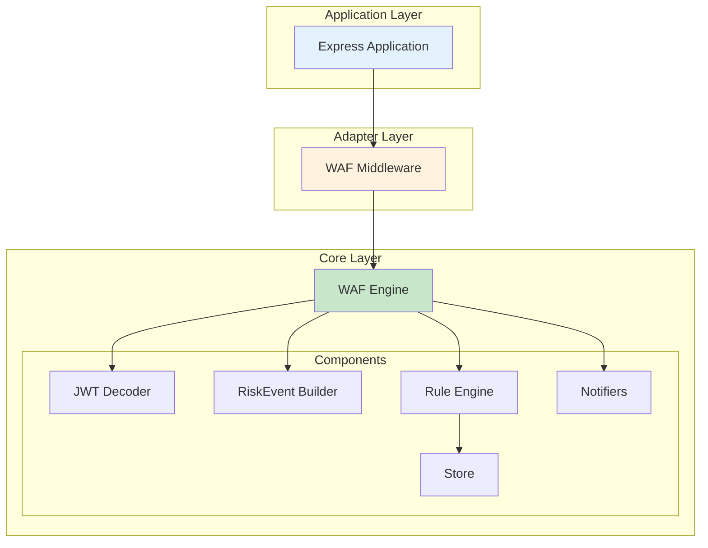
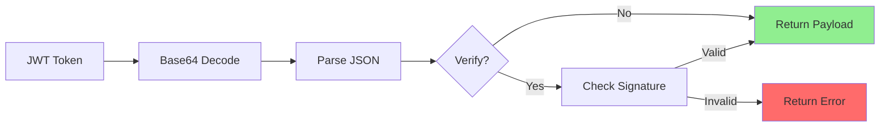
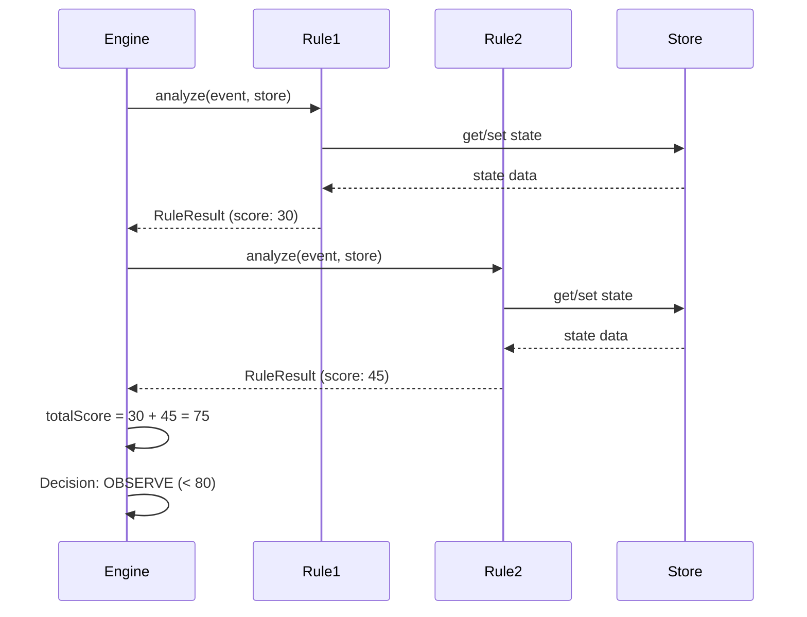
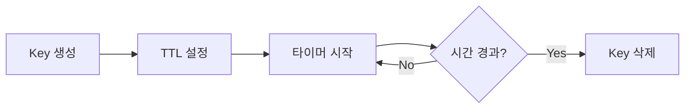
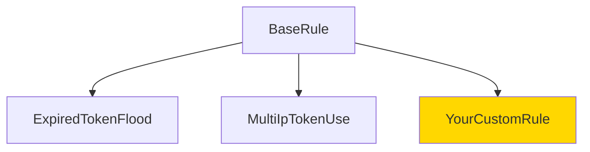
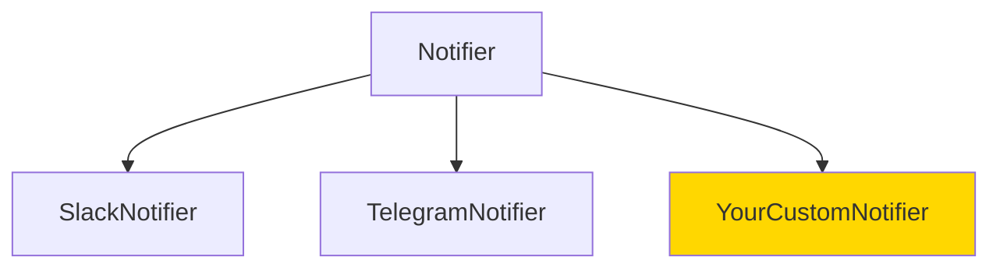
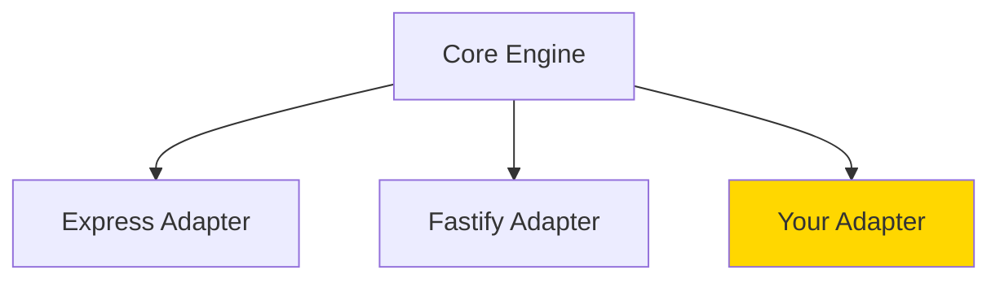
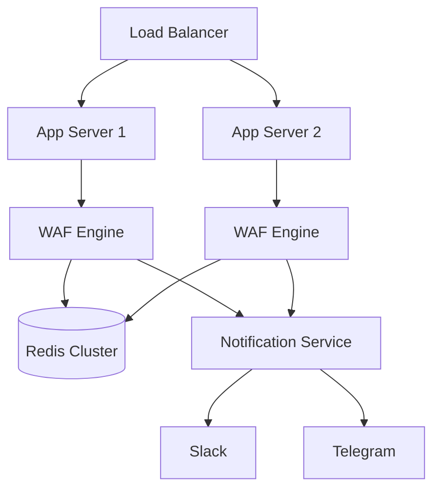

# 아키텍처 문서 🏗️

JWT WAF의 전체 아키텍처와 설계 원칙을 설명합니다.

## 전체 시스템 구조



## 계층 분리 원칙

### 1. Core Layer (프레임워크 독립)

**목적**: 순수한 비즈니스 로직만 포함

**패키지**: `@jwt-waf/core`

**구성 요소**:
- `types/`: TypeScript 타입 정의
- `engine/`: WAF 엔진 로직
- `rules/`: 보안 규칙
- `store/`: 상태 저장소
- `observability/`: 알림 시스템
- `logger/`: 로깅

**특징**:
- Express, Fastify 등 프레임워크 의존성 없음
- 순수 TypeScript 코드
- 단위 테스트 가능

### 2. Adapter Layer (프레임워크 통합)

**목적**: 특정 프레임워크와 Core 연결

**패키지**: `@jwt-waf/express-adapter`

**구성 요소**:
- `middleware/`: Express 미들웨어
- HTTP 요청/응답 처리
- 프레임워크별 에러 처리

**특징**:
- Core API 호출
- 프레임워크별 Request/Response 변환
- 에러 핸들링

### 3. Application Layer

**목적**: 실제 사용자 애플리케이션

**예제**: `examples/express-basic`

## 핵심 컴포넌트

### JWT Decoder



**기능**:
- Base64 URL 디코딩
- JSON 파싱
- 서명 검증 (선택)
- 만료 시간 체크

**특징**:
- 검증 실패 시에도 페이로드 반환 (분석 목적)
- 에러 정보 상세 기록

### RiskEvent Builder

**역할**: 요청 정보와 JWT를 결합하여 RiskEvent 생성

```typescript
interface RiskEvent {
  token: string;
  payload: JwtPayload | null;
  isValid: boolean;
  invalidReason?: string;
  ip: string;
  path: string;
  method: string;
  userAgent?: string;
  timestamp: number;
}
```

### Rule Engine

**처리 흐름**:



**점수 계산**:
```
totalScore = Σ(ruleScore)
decision = totalScore >= blockThreshold ? BLOCK : (mode == OBSERVE ? OBSERVE : ALLOW)
```

## 상태 관리

### Store 인터페이스

```typescript
interface Store {
  get(key: string): Promise<string | null>;
  set(key: string, value: string, ttl?: number): Promise<void>;
  increment(key: string, delta?: number): Promise<number>;
  delete(key: string): Promise<void>;
  expire(key: string, ttl: number): Promise<void>;
  keys(pattern: string): Promise<string[]>;
}
```

### InMemoryStore

**특징**:
- 단일 서버 환경
- 빠른 성능
- 프로세스 재시작 시 상태 손실

**TTL 관리**:


### RedisStore (확장 가능)

**특징**:
- 분산 환경 지원
- 영구 저장
- 여러 서버 간 상태 공유

**구현 예시**:
```typescript
import Redis from 'ioredis';

class RedisStore implements Store {
  private client: Redis;
  
  async get(key: string): Promise<string | null> {
    return await this.client.get(key);
  }
  
  async set(key: string, value: string, ttl?: number): Promise<void> {
    if (ttl) {
      await this.client.setex(key, ttl, value);
    } else {
      await this.client.set(key, value);
    }
  }
  
  // ...
}
```

## 확장 포인트

### 1. 커스텀 규칙



**구현**:
```typescript
class YourCustomRule extends BaseRule {
  async analyze(event: RiskEvent, store: Store): Promise<RuleResult> {
    // 커스텀 로직
  }
}
```

### 2. 커스텀 알림



**구현**:
```typescript
class YourCustomNotifier implements Notifier {
  async notify(event: NotificationEvent): Promise<void> {
    // 커스텀 알림 로직
  }
}
```

### 3. 커스텀 어댑터



**구현**:
```typescript
// Fastify 예제
function createFastifyWafPlugin(wafConfig: WafConfig) {
  return async (request, reply) => {
    const result = await wafEngine.analyzeRequest({
      token: extractToken(request),
      ip: request.ip,
      path: request.url,
      method: request.method
    });
    
    if (result.decision === Decision.BLOCK) {
      reply.code(403).send({ error: 'Blocked' });
    }
  };
}
```

## 성능 최적화

### 1. 비동기 처리

모든 I/O 작업은 비동기:
- Store 조회/저장
- 알림 전송
- JWT 검증

### 2. TTL 기반 상태 관리

메모리 효율성:
- 만료된 상태 자동 제거
- 메모리 누수 방지

### 3. 경량 의존성

Core 패키지:
- 필수 의존성만 포함
- 트리 쉐이킹 가능

## 보안 고려사항

### 1. JWT 검증

**서명 검증 비활성화 (기본)**:
- 공격 패턴 분석이 목적
- 만료/잘못된 토큰도 분석 필요

**서명 검증 활성화 (선택)**:
```typescript
wafConfig: {
  verifySignature: true,
  jwtSecret: process.env.JWT_SECRET
}
```

### 2. 로그 민감 정보

**자동 마스킹**:
- JWT 토큰 일부만 로그
- 사용자 ID 해싱 (선택)

### 3. DDoS 방어

**Rate Limiting과 결합**:
```typescript
app.use(rateLimit({ windowMs: 60000, max: 100 }));
app.use(createWafMiddleware({ /* ... */ }));
```

## 모니터링

### 로그 구조

```json
{
  "level": "WARN",
  "timestamp": "2026-02-15T12:00:00.000Z",
  "message": "규칙 트리거",
  "ruleName": "MultiIpTokenUse",
  "score": 45,
  "reason": "3개 IP에서 토큰 사용",
  "details": {
    "ip": "1.2.3.4",
    "path": "/api/users",
    "userId": "user123"
  }
}
```

### 메트릭 (향후 구현)

- `waf_requests_total`: 총 요청 수
- `waf_blocks_total`: 총 차단 수
- `waf_score_distribution`: 점수 분포
- `waf_analysis_duration`: 분석 시간

## 프로덕션 배포

### 권장 구성



### 체크리스트

- [ ] OBSERVE 모드로 시작
- [ ] 오탐률 모니터링 (최소 1주일)
- [ ] Redis Store 사용 (분산 환경)
- [ ] 알림 채널 설정
- [ ] 로그 수집 시스템 연동
- [ ] 메트릭 모니터링 설정
- [ ] BLOCK 모드로 전환

## 더 알아보기

- [5분 빠른 시작](./QUICK_START.md)
- [규칙 가이드](./RULES.md)
- [알림 가이드](./NOTIFICATIONS.md)
- [기여 가이드](../CONTRIBUTING.md)
