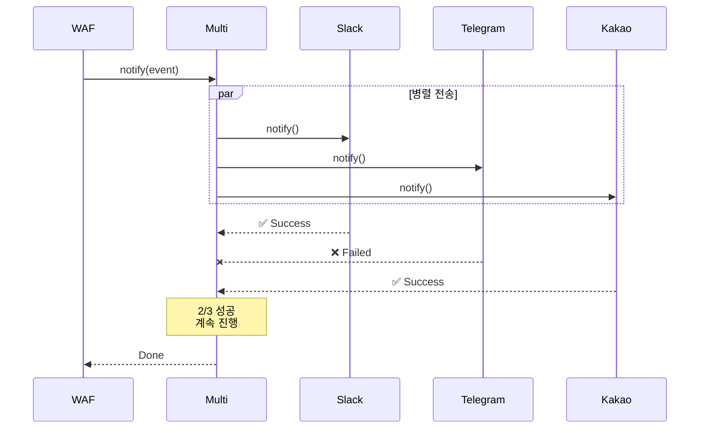

# 알림 시스템 가이드 🔔

JWT WAF의 실시간 알림 시스템을 설정하고 사용하는 방법을 설명합니다.

## 지원 채널

```mermaid
graph TB
    WAF[WAF Engine] --> Multi[MultiNotifier]
    
    Multi --> Slack[Slack<br/>Incoming Webhook]
    Multi --> Telegram[Telegram<br/>Bot API]
    Multi --> Kakao[카카오워크<br/>Webhook]
    Multi --> Custom[커스텀<br/>Notifier]
    
    style WAF fill:#667eea
    style Multi fill:#f093fb
    style Slack fill:#4A154B
    style Telegram fill:#0088cc
    style Kakao fill:#FEE500
    style Custom fill:#9E9E9E
```



## 알림 이벤트 타입

### NotificationEvent 구조

```typescript
interface NotificationEvent {
  type: 'BLOCK' | 'HIGH_RISK' | 'ATTACK_PATTERN';
  severity: 'LOW' | 'MEDIUM' | 'HIGH' | 'CRITICAL';
  message: string;
  details: {
    ip?: string;
    path?: string;
    method?: string;
    userId?: string;
    totalScore?: number;
    rules?: string[];
    timestamp: number;
  };
}
```

### 이벤트 타입

| 타입 | 심각도 | 트리거 조건 |
|------|--------|-------------|
| **BLOCK** | HIGH/CRITICAL | 요청이 차단되었을 때 |
| **HIGH_RISK** | MEDIUM/HIGH | 특정 점수 이상일 때 |
| **ATTACK_PATTERN** | MEDIUM/HIGH | 공격 패턴 감지 시 |

## Slack 알림

### 1. Webhook URL 생성

1. Slack 워크스페이스에서 [Incoming Webhooks](https://api.slack.com/messaging/webhooks) 앱 추가
2. 채널 선택
3. Webhook URL 복사

### 2. 설정

```typescript
import { SlackNotifier } from '@jwt-waf/core';

const slackNotifier = new SlackNotifier(
  'https://hooks.slack.com/services/YOUR/WEBHOOK/URL'
);

wafConfig: {
  // ... 기본 설정
  notifiers: [slackNotifier]
}
```

### 3. 메시지 형식

```
🚨 WAF Alert: 요청이 차단되었습니다

Type: BLOCK          Severity: HIGH
IP: 192.168.1.100    Score: 90
Path: /api/admin/users
Method: DELETE
User ID: attacker123
Triggered Rules: PrivilegeEndpointWeighting, MultiIpTokenUse
```

**색상 구분**:
- 🔴 CRITICAL: Red
- 🟠 HIGH: Orange
- 🟡 MEDIUM: Yellow
- 🟢 LOW: Green

### 4. 고급 설정

```typescript
// 특정 채널에만 알림
class CustomSlackNotifier extends SlackNotifier {
  async notify(event: NotificationEvent): Promise<void> {
    if (event.severity === 'CRITICAL') {
      // 긴급 채널로 전송
      const urgentWebhook = 'https://hooks.slack.com/.../urgent';
      // ...
    } else {
      await super.notify(event);
    }
  }
}
```

---

## Telegram 알림

### 1. Bot 생성

1. Telegram에서 [@BotFather](https://t.me/botfather) 찾기
2. `/newbot` 명령어로 봇 생성
3. Bot Token 복사

### 2. Chat ID 확인

```bash
# 봇과 대화 시작 후
curl https://api.telegram.org/bot<YOUR_BOT_TOKEN>/getUpdates
```

Response에서 `chat.id` 확인

### 3. 설정

```typescript
import { TelegramNotifier } from '@jwt-waf/core';

const telegramNotifier = new TelegramNotifier(
  'YOUR_BOT_TOKEN',
  'YOUR_CHAT_ID'
);

wafConfig: {
  notifiers: [telegramNotifier]
}
```

### 4. 메시지 형식

```
🚨 WAF Alert

Type: BLOCK
Severity: HIGH
Message: 요청이 차단되었습니다

Details:
• IP: `192.168.1.100`
• Path: `/api/admin/users`
• Method: `DELETE`
• User ID: `attacker123`
• Score: 90
• Rules: PrivilegeEndpointWeighting, MultiIpTokenUse
```

**Markdown 지원**:
- 코드: \`text\`
- 볼드: \*\*text\*\*
- 이탤릭: \_text\_

---

## 카카오톡 알림 (카카오워크)

### 1. Webhook URL 생성

1. [카카오워크 관리자](https://admin.kakaowork.com) 로그인
2. 봇 생성
3. Webhook URL 생성

### 2. 설정

```typescript
import { KakaoNotifier } from '@jwt-waf/core';

const kakaoNotifier = new KakaoNotifier(
  'https://kakaowork.webhook.url'
);

wafConfig: {
  notifiers: [kakaoNotifier]
}
```

### 3. 메시지 형식

```
🚨 [WAF 알림] 요청이 차단되었습니다

심각도: HIGH
IP: 192.168.1.100
경로: /api/admin/users
메서드: DELETE
사용자 ID: attacker123
점수: 90
트리거된 규칙: PrivilegeEndpointWeighting, MultiIpTokenUse

발생 시각: 2026-02-15 12:00:00
```

**블록 스타일**:
- Header (색상 지정)
- Section (상세 정보)
- Context (타임스탬프)

---

## 복수 채널 알림

### MultiNotifier 사용

```typescript
import {
  SlackNotifier,
  TelegramNotifier,
  KakaoNotifier,
  MultiNotifier
} from '@jwt-waf/core';

const multiNotifier = new MultiNotifier([
  new SlackNotifier(slackWebhook),
  new TelegramNotifier(botToken, chatId),
  new KakaoNotifier(kakaoWebhook)
]);

wafConfig: {
  notifiers: [multiNotifier],
  notificationRules: {
    onBlock: true,        // 차단 시 모든 채널에 알림
    onHighRisk: 70,       // 70점 이상 시 알림
    onAttackPattern: true // 공격 패턴 감지 시 알림
  }
}
```

### 독립적인 에러 처리



**특징**:
- 하나의 채널 실패가 다른 채널에 영향 없음
- Promise.allSettled 사용
- 실패한 채널만 로그 기록

---

## 알림 규칙 설정

### 시나리오별 설정

#### 1. 차단 시에만 알림

```typescript
notificationRules: {
  onBlock: true
}
```

#### 2. 높은 점수 감지

```typescript
notificationRules: {
  onHighRisk: 70  // 70점 이상
}
```

#### 3. 공격 패턴 감지

```typescript
notificationRules: {
  onAttackPattern: true
}
```

#### 4. 복합 설정

```typescript
notificationRules: {
  onBlock: true,          // 차단 시
  onHighRisk: 60,         // 60점 이상
  onAttackPattern: true   // 공격 패턴
}
```

### 심각도별 채널 분리

```typescript
class SeverityBasedMultiNotifier implements Notifier {
  private urgentNotifiers: Notifier[];
  private normalNotifiers: Notifier[];

  async notify(event: NotificationEvent): Promise<void> {
    if (event.severity === 'CRITICAL' || event.severity === 'HIGH') {
      // 긴급 채널 (Slack, Telegram)
      await Promise.all(
        this.urgentNotifiers.map(n => n.notify(event))
      );
    } else {
      // 일반 채널 (Kakao)
      await Promise.all(
        this.normalNotifiers.map(n => n.notify(event))
      );
    }
  }
}
```

---

## 커스텀 알림 채널

### Discord 예제

```typescript
import { Notifier, NotificationEvent } from '@jwt-waf/core';
import axios from 'axios';

export class DiscordNotifier implements Notifier {
  constructor(private readonly webhookUrl: string) {}

  async notify(event: NotificationEvent): Promise<void> {
    const payload = {
      content: `🚨 ${event.message}`,
      embeds: [{
        title: event.type,
        color: this.getColor(event.severity),
        fields: [
          { name: 'Severity', value: event.severity, inline: true },
          { name: 'IP', value: event.details.ip || 'N/A', inline: true },
          { name: 'Score', value: String(event.details.totalScore), inline: true },
          { name: 'Path', value: event.details.path || 'N/A' }
        ],
        timestamp: new Date(event.details.timestamp).toISOString()
      }]
    };

    await axios.post(this.webhookUrl, payload);
  }

  private getColor(severity: string): number {
    const colors = {
      CRITICAL: 0xFF0000,
      HIGH: 0xFF6B00,
      MEDIUM: 0xFFD700,
      LOW: 0x00FF00
    };
    return colors[severity] || 0x808080;
  }
}
```

### Email 예제

```typescript
import { Notifier, NotificationEvent } from '@jwt-waf/core';
import nodemailer from 'nodemailer';

export class EmailNotifier implements Notifier {
  private transporter;

  constructor(config: {
    host: string;
    port: number;
    auth: { user: string; pass: string };
  }) {
    this.transporter = nodemailer.createTransporter(config);
  }

  async notify(event: NotificationEvent): Promise<void> {
    await this.transporter.sendMail({
      from: 'waf@yourcompany.com',
      to: 'security@yourcompany.com',
      subject: `[WAF] ${event.type} - ${event.severity}`,
      html: this.formatEmail(event)
    });
  }

  private formatEmail(event: NotificationEvent): string {
    return `
      <h2>🚨 ${event.message}</h2>
      <p><strong>Type:</strong> ${event.type}</p>
      <p><strong>Severity:</strong> ${event.severity}</p>
      <p><strong>IP:</strong> ${event.details.ip}</p>
      <p><strong>Score:</strong> ${event.details.totalScore}</p>
    `;
  }
}
```

---

## 테스트

### 수동 테스트

```typescript
import { SlackNotifier } from '@jwt-waf/core';

const slackNotifier = new SlackNotifier(webhookUrl);

await slackNotifier.notify({
  type: 'BLOCK',
  severity: 'HIGH',
  message: '테스트 알림입니다',
  details: {
    ip: '127.0.0.1',
    path: '/test',
    totalScore: 85,
    timestamp: Date.now()
  }
});
```

### 실제 공격 시뮬레이션

```bash
# 만료된 토큰 5회 시도
for i in {1..5}; do
  curl -H "Authorization: Bearer EXPIRED_TOKEN" \
    http://localhost:3000/api/users
done

# Slack/Telegram/Kakao에서 알림 확인
```

---

## 모범 사례

### 1. 환경 변수 사용

```typescript
const slackNotifier = new SlackNotifier(
  process.env.SLACK_WEBHOOK_URL!
);

const telegramNotifier = new TelegramNotifier(
  process.env.TELEGRAM_BOT_TOKEN!,
  process.env.TELEGRAM_CHAT_ID!
);
```

### 2. 알림 빈도 제한

```typescript
class RateLimitedNotifier implements Notifier {
  private lastNotification = 0;
  private minInterval = 60000; // 1분

  async notify(event: NotificationEvent): Promise<void> {
    const now = Date.now();
    if (now - this.lastNotification < this.minInterval) {
      console.log('알림 스킵 (빈도 제한)');
      return;
    }

    // 실제 알림 전송
    await this.actualNotifier.notify(event);
    this.lastNotification = now;
  }
}
```

### 3. 에러 처리

```typescript
wafConfig: {
  notifiers: [slackNotifier],
  onNotificationError: (error) => {
    console.error('알림 전송 실패:', error);
    // 에러 로그 저장, 재시도 등
  }
}
```

---

## 문제 해결

### Q: Slack 알림이 안 와요

**A**: Webhook URL 확인:
```bash
curl -X POST -H 'Content-Type: application/json' \
  -d '{"text":"테스트"}' \
  https://hooks.slack.com/services/YOUR/WEBHOOK/URL
```

### Q: Telegram 알림이 안 와요

**A**: Bot Token과 Chat ID 확인:
```bash
curl https://api.telegram.org/bot<TOKEN>/sendMessage\?chat_id\=<CHAT_ID>\&text\=테스트
```

### Q: 알림이 너무 많이 와요

**A**: 알림 규칙 조정:
```typescript
notificationRules: {
  onBlock: true,      // 차단만
  onHighRisk: 90      // 매우 높은 점수만
}
```

---

## 더 알아보기

- [아키텍처](./ARCHITECTURE.md)
- [규칙 가이드](./RULES.md)
- [5분 빠른 시작](./QUICK_START.md)
- [기여 가이드](../CONTRIBUTING.md)
