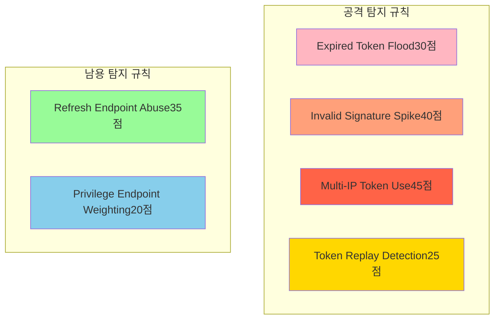
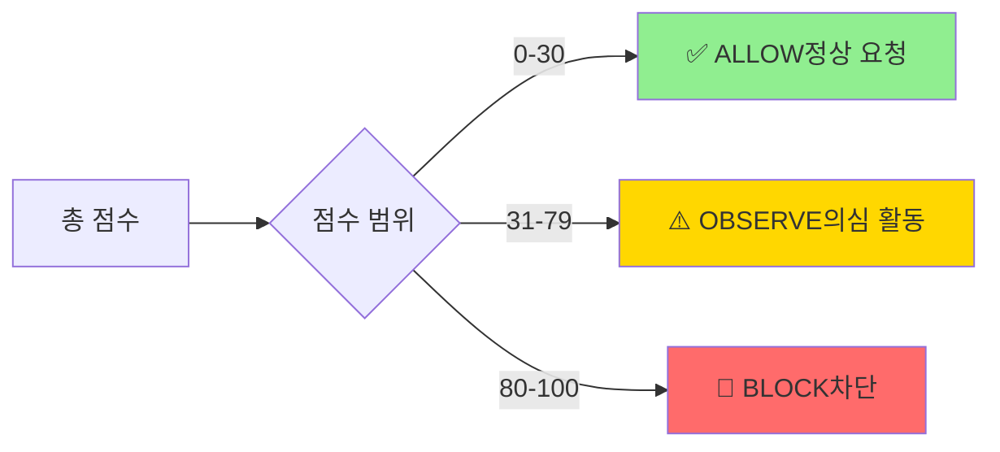
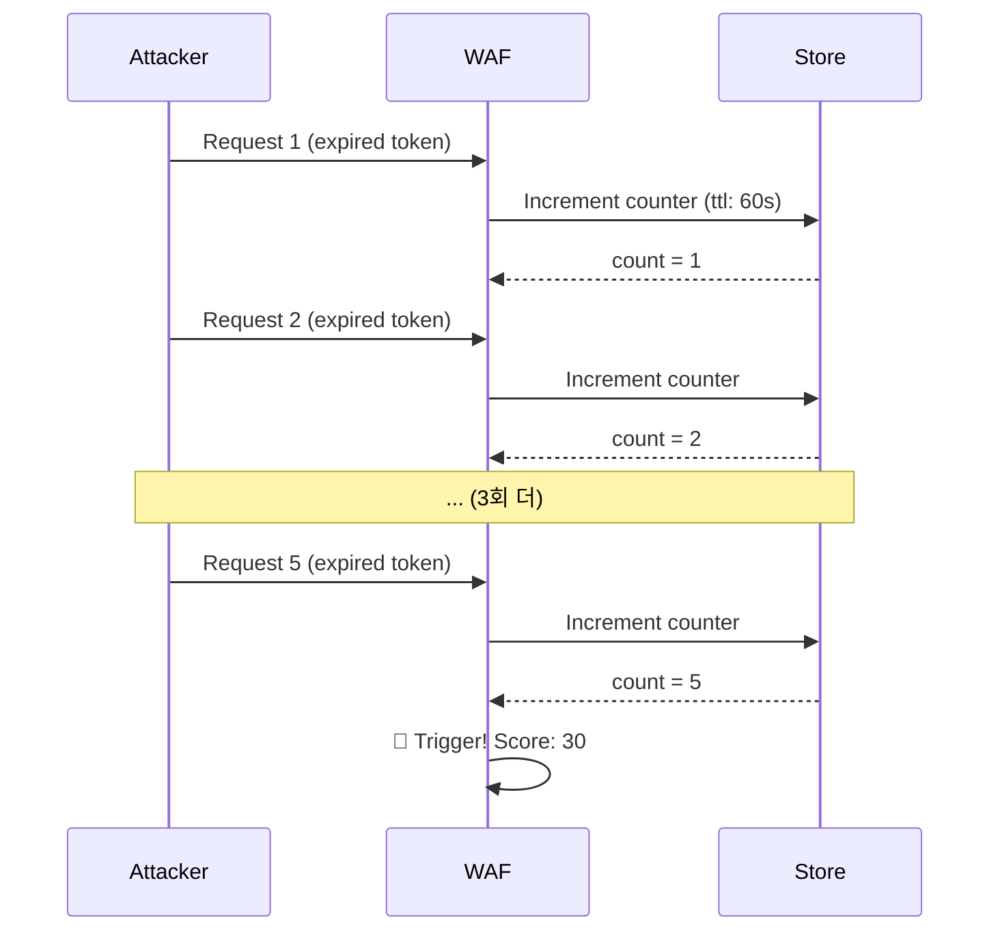
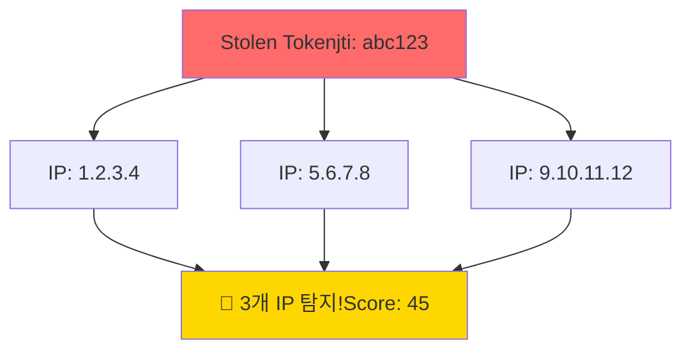
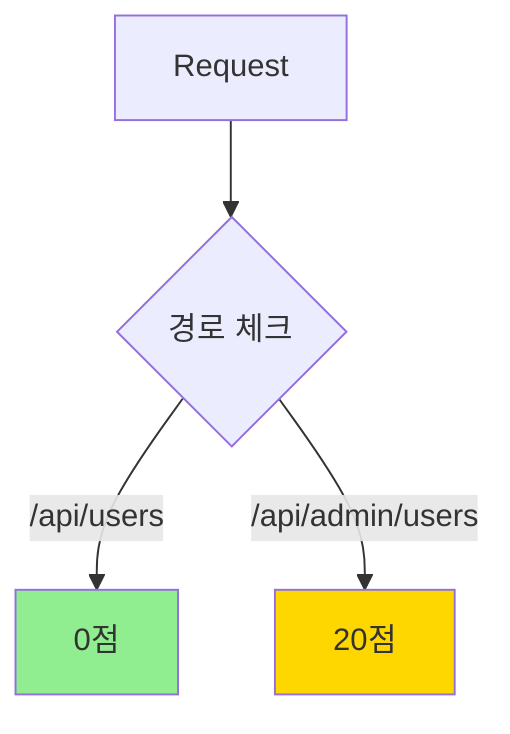
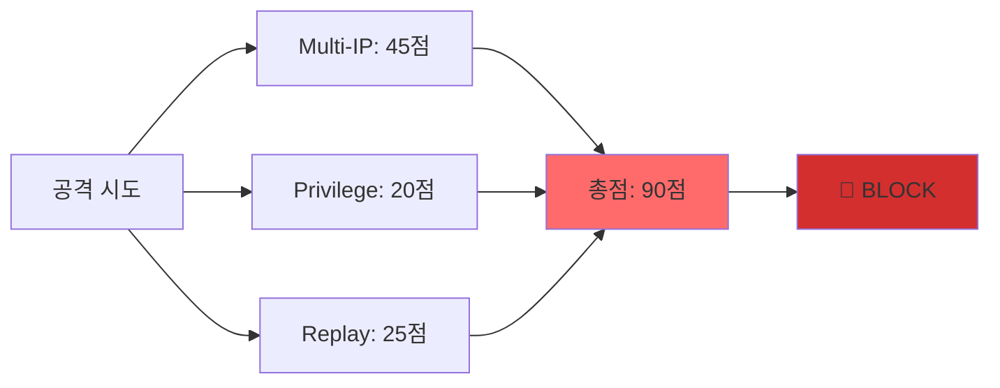

# 보안 규칙 가이드 🛡️

JWT WAF의 6개 보안 규칙을 상세히 설명합니다.

## 규칙 개요



## 점수 시스템



## 규칙 상세

### 1. Expired Token Flood (30점)

**목적**: 만료된 토큰을 반복적으로 시도하는 무차별 대입 공격 탐지

**트리거 조건**:
- 같은 IP에서
- 60초 내에
- 만료된 토큰 5회 이상 시도

**시나리오**:


**오탐 방지**:
- 임계값: 5회 (정상 사용자는 1-2회 재시도)
- TTL: 60초 (짧은 시간 창)

**설정**:
```typescript
import { ExpiredTokenFloodRule } from '@jwt-waf/core';

new ExpiredTokenFloodRule()  // 기본 설정 사용
```

---

### 2. Invalid Signature Spike (40점)

**목적**: JWT 서명을 조작하여 권한 상승을 시도하는 공격 탐지

**트리거 조건**:
- 같은 IP에서
- 300초 (5분) 내에
- 서명 검증 실패 10회 이상

**시나리오**:
공격자가 `admin: false`를 `admin: true`로 변조하여 반복 시도

**오탐 방지**:
- 임계값: 10회 (잘못된 설정으로 1-2회 실패는 가능)
- TTL: 300초 (충분한 시간 창)
- `verifySignature: true` 필요

**설정**:
```typescript
import { InvalidSignatureSpikeRule } from '@jwt-waf/core';

wafConfig: {
  verifySignature: true,  // 필수!
  jwtSecret: process.env.JWT_SECRET,
  rules: [
    new InvalidSignatureSpikeRule()
  ]
}
```

---

### 3. Multi-IP Token Use (45점)

**목적**: 토큰 탈취 후 여러 위치에서 동시 사용 탐지

**트리거 조건**:
- 같은 JTI (JWT ID)가
- 600초 (10분) 내에
- 3개 이상 다른 IP에서 사용

**시나리오**:


**오탐 방지**:
- 임계값: 3개 IP (VPN 변경 등 고려)
- TTL: 600초
- JTI 기반 추적 (토큰별 관리)

**설정**:
```typescript
import { MultiIpTokenUseRule } from '@jwt-waf/core';

new MultiIpTokenUseRule()
```

**참고**: JWT에 `jti` 필드 필요

---

### 4. Token Replay Detection (25점)

**목적**: 임계값을 초과한 토큰 재사용 탐지

**트리거 조건**:
- 같은 JTI가
- 60초 내에
- 30회 이상 재사용

**시나리오**:
자동화된 스크립트로 토큰을 과도하게 재사용

**오탐 방지**:
- 임계값: 30회 (정상 사용자는 초당 0.5회 수준)
- TTL: 60초

**설정**:
```typescript
import { TokenReplayDetectionRule } from '@jwt-waf/core';

new TokenReplayDetectionRule()
```

---

### 5. Refresh Endpoint Abuse (35점)

**목적**: 리프레시 엔드포인트의 과도한 호출 탐지

**트리거 조건**:
- 같은 사용자 (sub)가
- 600초 (10분) 내에
- `/refresh` 경로를 20회 이상 호출

**시나리오**:
```mermaid
graph LR
    A[Attacker] -->|refresh x20| B[/api/auth/refresh]
    B --> C[🚨 Abuse 탐지!Score: 35]
    
    style C fill:#FFD700
```

**오탐 방지**:
- 임계값: 20회 (정상적으로는 1-2회)
- TTL: 600초
- 경로 패턴: `/refresh`, `/token/refresh`

**설정**:
```typescript
import { RefreshEndpointAbuseRule } from '@jwt-waf/core';

new RefreshEndpointAbuseRule()
```

---

### 6. Privilege Endpoint Weighting (20점)

**목적**: 민감한 관리자 엔드포인트 접근 모니터링

**트리거 조건**:
- `/admin/*`, `/api/admin/*` 경로 접근 시 즉시 트리거

**시나리오**:


**오탐 방지**:
- 점수만 부여 (단독으로는 차단 안 함)
- 복합 공격 감지용

**설정**:
```typescript
import { PrivilegeEndpointWeightingRule } from '@jwt-waf/core';

new PrivilegeEndpointWeightingRule()
```

---

## 복합 공격 예시

### 예시 1: 토큰 탈취 + 관리자 접근



**점수 계산**:
```
Multi-IP Token Use:          45점
Privilege Endpoint:          20점
Token Replay Detection:      25점
────────────────────────────────
총점:                        90점 → BLOCK (>= 80)
```

### 예시 2: 리프레시 남용 + 서명 위조

```
Refresh Endpoint Abuse:      35점
Invalid Signature Spike:     40점
────────────────────────────────
총점:                        75점 → OBSERVE (< 80)
```

## 커스텀 규칙 작성

### BaseRule 상속

```typescript
import { BaseRule, RiskEvent, Store, RuleResult } from '@jwt-waf/core';

export class MyCustomRule extends BaseRule {
  constructor() {
    super(
      'MyCustomRule',           // 규칙 이름
      '커스텀 공격 패턴 탐지',  // 설명
      8,                        // 가중치 (1-10)
      true                      // 활성화
    );
  }

  async analyze(event: RiskEvent, store: Store): Promise<RuleResult> {
    // 1. 조건 체크
    if (!this.shouldAnalyze(event)) {
      return this.passResult();
    }

    // 2. Store에서 상태 조회
    const key = `rule:custom:${event.ip}`;
    const count = await this.getCounterValue(store, key);

    // 3. 임계값 체크
    const threshold = 10;
    if (count >= threshold) {
      return {
        ruleName: this.name,
        score: this.weight * 10,  // 최대 80점
        reason: `임계값 ${threshold}회 초과`,
        details: { count, threshold }
      };
    }

    // 4. 카운터 증가
    await this.incrementCounter(store, key, 1, 300);  // 5분 TTL

    return this.passResult();
  }

  private shouldAnalyze(event: RiskEvent): boolean {
    // 커스텀 조건
    return event.isValid && event.path.startsWith('/api/sensitive');
  }
}
```

### 사용

```typescript
import { MyCustomRule } from './my-custom-rule';

wafConfig: {
  rules: [
    new MyCustomRule(),
    // ... 기본 규칙들
  ]
}
```

## 규칙 비활성화

특정 규칙을 비활성화하려면 제외:

```typescript
wafConfig: {
  rules: [
    new ExpiredTokenFloodRule(),
    // new InvalidSignatureSpikeRule(),  // 비활성화
    new MultiIpTokenUseRule()
  ]
}
```

## 모범 사례

### 1. 단계적 적용

```typescript
// 1단계: OBSERVE 모드로 시작
mode: WafMode.OBSERVE

// 2주 후: 오탐 확인 후 BLOCK 모드
mode: WafMode.BLOCK
```

### 2. 알림 설정

```typescript
notificationRules: {
  onBlock: true,        // 차단 시 즉시 알림
  onHighRisk: 70,       // 70점 이상 시 경고
  onAttackPattern: true // 복합 공격 탐지 시 알림
}
```

### 3. 로그 모니터링

주간 리포트 확인:
- 가장 많이 트리거된 규칙
- 오탐 패턴 분석
- 임계값 조정

## 문제 해결

### Q: 정상 사용자가 차단되었어요

**A**: OBSERVE 모드로 전환하고 로그 분석:
```bash
# 특정 IP 패턴 검색
grep "1.2.3.4" logs/waf.log | grep "BLOCK"
```

### Q: 공격이 탐지되지 않아요

**A**: 임계값 확인 및 조정:
- 규칙별 트리거 조건 검토
- Store 상태 확인 (TTL 만료?)

### Q: 규칙 순서가 중요한가요?

**A**: 아니요. 모든 규칙이 독립적으로 실행되고 점수가 합산됩니다.

## 더 알아보기

- [아키텍처](./ARCHITECTURE.md)
- [알림 가이드](./NOTIFICATIONS.md)
- [5분 빠른 시작](./QUICK_START.md)
- [기여 가이드](../CONTRIBUTING.md)
